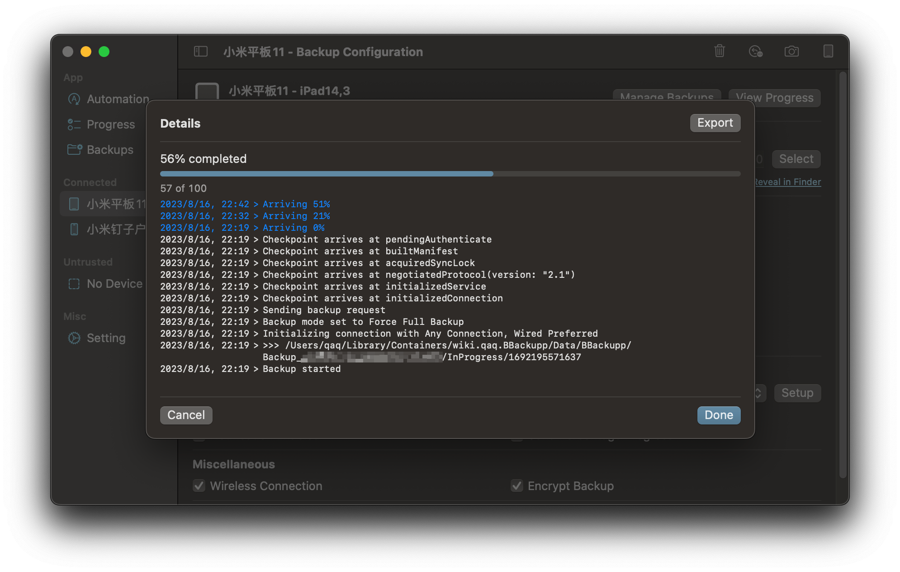
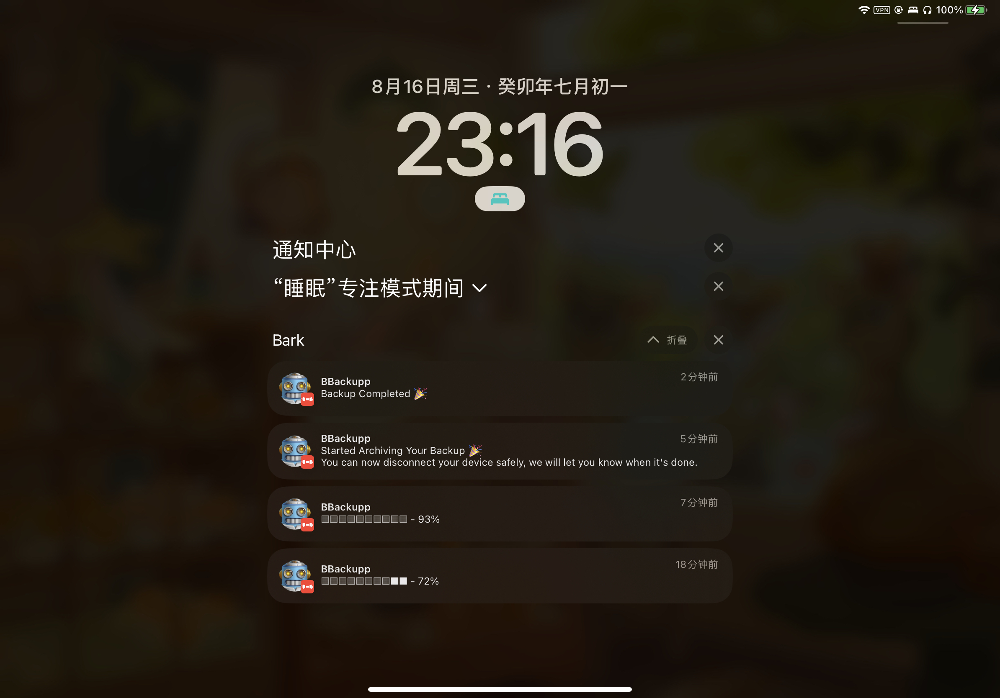
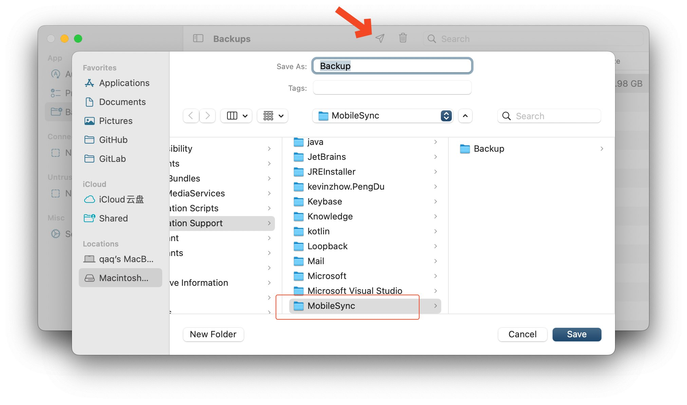

# BBackupp

Backup iOS devices the way it should be. Sandboxed single binary for all your stuff with automation support.

## Features

- [x] Backup iOS/iPad/visionOS(maybe) devices
- [x] Backup encryption
- [x] Backup compression
- [x] Backup to external drive
- [x] Backup to network drive
- [x] Wireless backup (after initial setup)
- [x] Unpack backup to iTunes/Finder for restore
- [x] Automatic backup when device is connected
- [x] Automatic backup when device is connected to power
- [x] Backup notifications (needs setup with provider)

## Notifications

While you wait for the backup, we will send you notifications at beginning and end of the backup process. We will also send you a notification if the backup failed.

Currently we support the following notification providers:

- [x] Bark (https://github.com/Finb/Bark)

## Restore

The default unpack location at "Backups" tab is the system storage for mobile backups. Click Save and use Finder to restore to your device.

## License

GNU GENERAL PUBLIC LICENSE Version 3, 29 June 2007

See [License](./LICENSE) for details. May change over time.

## Disclaimer

We are not responsible for any consequences resulting from the use of this program. Below, we list some potential occurrences for your awareness.

- App crashes.
- None-working backups.
- Computer crashes, freezes, or restarts.
- Computer chip damage.
- Screen glitches, white screens, black screens, flashing screens.
- Arriving late to work.
- Being scolded by your wife or daughter for something you wrote.
- Getting caught by your boss while slacking off.
- Facing dismissal from your job.
- Handling of leaked confidential information by the security department.
- Unfortunate events.
- Transforming into a cat.
- Earth exploding.
- Universe rebooting.
- Anything else that you can think of.

---

Copyright © 2023 Lakr Aream. All Rights Reserved.

