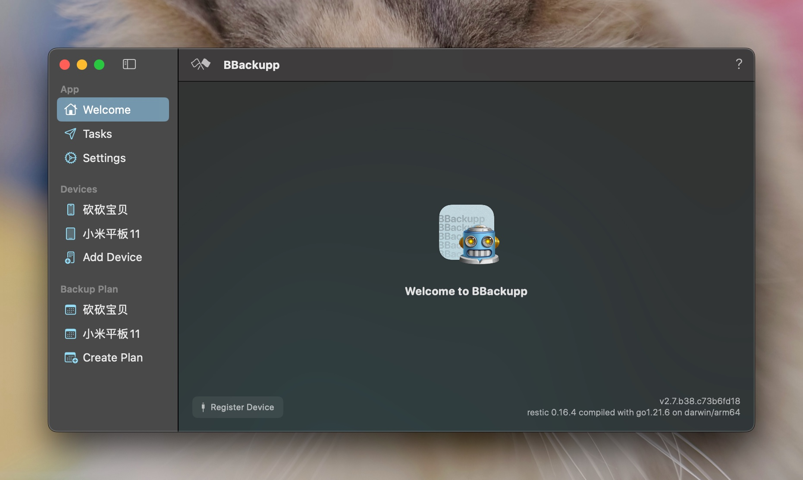
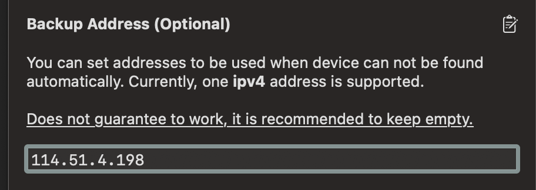
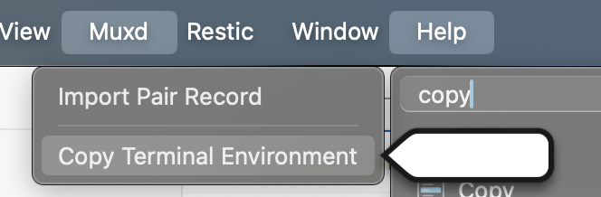
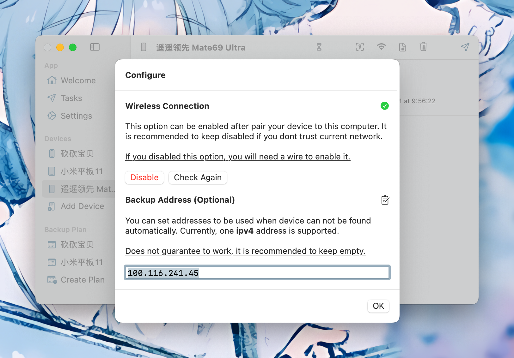
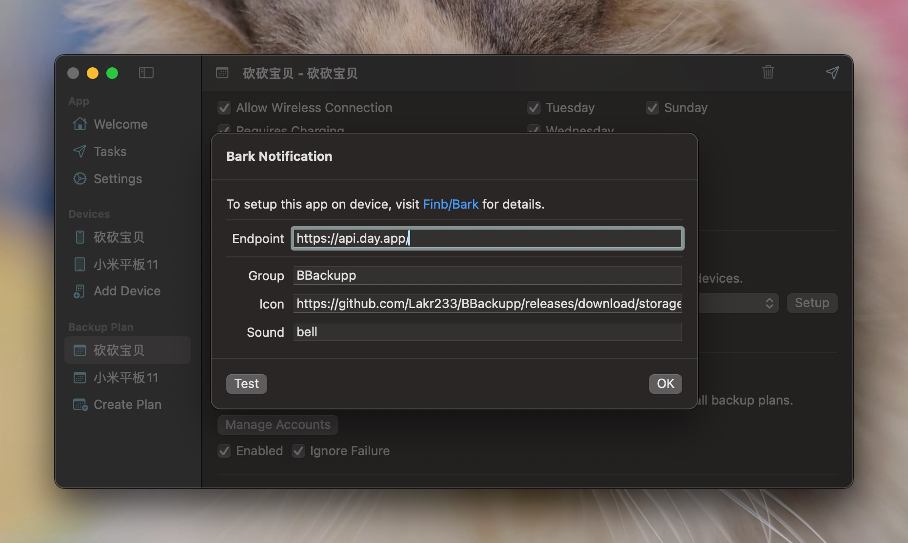

# BBackupp

Back up your iOS devices the way it's meant to be done.

## Features

- [x] Effortlessly back up iOS devices.
- [x] Monitor backup progress for each file.
- [x] Perform one-time backups to local storage.
- [x] **Enable wireless backups with IP address support.**
- [x] **Seamless setup with Transferable Pair Record.**
- [x] Secure your backups with encryption.
- [x] Automate your backup schedule.
- [x] **Automatically download app installers from the App Store.**
- [x] Utilize snapshot technology for storing backups.
- [x] **Support for storing backups locally, via SFTP, S3, and more.**
- [x] Receive notifications throughout the backup process.
- [x] Includes a simple alive checker via GET request.

## ~~Partial Open Source Notice~~

~~Starting from version 2.0, certain components are not included in the open-source repository:~~

- ~~Code interfacing with the App Store API.~~
- ~~User interface components.~~
- ~~MuxProxy related code.~~
- ~~Assets.xcassets~~

~~To build your own BBackupp, you'll need to develop a custom user interface and exclude the features listed above.~~

BBackupp v2.0 is now fully open-source. You can build your own version with the included source code. Please refer to the [License](./LICENSE) for more information.

**I am unable to provide ongoing maintenance for this code due to time constraints. Therefore I made the decision to open-source it.**

**It is unlikely that I will be able to provide support or update the code in the future.**

## MuxProxy

MuxProxy facilitates device discovery in environments where mDNS may not be available, allowing for the use of TailScale or ZeroTier.

For integrating your toolchain with `libusbmuxd` and MuxProxy, launch BBackupp and locate the `Copy Terminal Environment` button under the Muxd menu.

If you're considering using a tunnel to connect your device, we strongly recommend a high-speed internet connection. Without it, completing a backup in a timely manner might not be feasible. Please note that we are not responsible for resolving networking issues you may encounter. With the standard Tailscale configuration, transferring device information takes approximately 15 seconds. Optimizing this setup is entirely up to you.

## Transferable Pair Record

Support for transferable pair records allows you to set up a device on one computer and then export the record for use on another machine.

**Note: Not all pair records are compatible with this feature.**

We recommend backing up your device using a wired connection at least once before exporting the record.

> Technical note: The EscowBag (device backup key) is transferred to the host (in this case, your Mac) at an unspecified time. If your pair record already contains this key, it should function correctly.

To register a device without connecting to it directly, navigate to `Import Pair Record` in the `Muxd` menu. Enter an IP address and verify its accessibility.

## Notifications

During the backup process, we'll send notifications at the start and end, as well as if the backup fails.

We currently support the following notification providers:

- [x] Bark (https://github.com/Finb/Bark)
- [x] Telegram Bot (https://t.me/BotFather)

## License

GNU GENERAL PUBLIC LICENSE Version 3, 29 June 2007

Refer to [License](./LICENSE) for more details. Subject to change.

## Disclaimer

We are not liable for any consequences arising from the use of this software. Potential issues include, but are not limited to:

- Application crashes.
- Backups failing to work.
- Computer crashes, freezes, or restarts.
- Damage to computer components.
- Screen glitches, including white, black, or flashing screens.
- Being late for work.
- Reprimands from family members.
- Being caught by your boss while not working.
- Risk of job termination.
- Legal issues related to leaked confidential information.
- Unforeseen mishaps.
- Turning into a cat.
- Cat scratches.
- The Earth exploding.
- A reboot of the universe.
- Any other imaginable scenario.

---

Copyright © 2024 Lakr Aream. All Rights Reserved.
